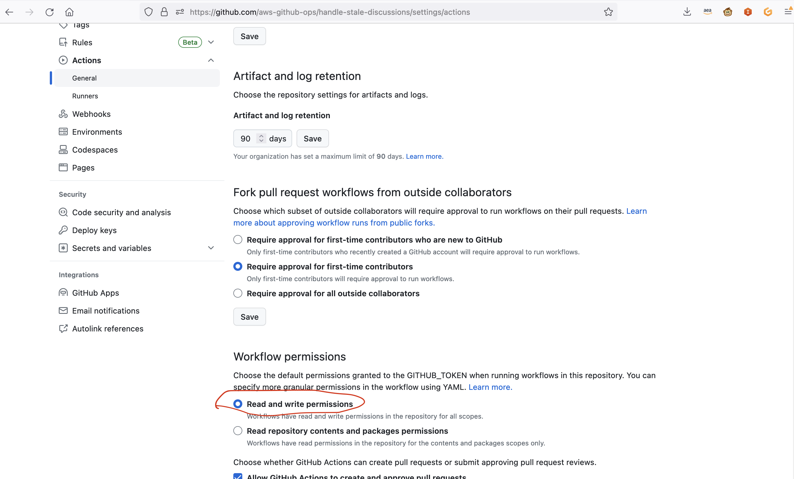

# "Handle Stale Discussions" Action for Github Action

This Github action checks the **answerable discussions** in your repository for an answer with the keyword `@github-actions proposed-answer`. If a positive reaction (thumbsup, laughing, rocket, heart, hooray) is received on the proposed answer, the discussion is marked as answered and closed as resolved. Otherwise if a negative reaction (thumbsdown, confused) is added or a reply is received, a label (`attention` by default) is added so the discussion can gain attention from the repository maintainers. If there is no reaction or response to a proposed answer after 7 days by default, the discussion is closed as outdated.

If this workflow is configured to run when a discussion comment is created, then it will check if the newly created comment is a proposed answer. If it is, then an instructions response will be posted right away. This way, people can immediately know how to interact with the discussions bot. Please note, this is the only action that will occur on a new comment event trigger. Any other event which invokes this action will process all answerable discussions and comments in the repository.

In addition to handling proposed answers, this action will automatically close any discussions that have a marked answer as resolved, and it will automatically close any locked discussions as outdated. Both of these functionalities can be disabled.

## Steps to enable this action in your repository

1. A valid GitHub token is required to use this action. The GITHUB_TOKEN for your repository can be generated by GitHub during workflow execution when passed in as `${{ secrets.GITHUB_TOKEN }}`. Please check the permissions in Repository settings to grant write permissions to the token.



2. Make sure your repo contains a label named `attention`, or a different label that can be provided as input.
3. Make sure you have a discussion category that is answerable. This workflow only works on answerable discussions.
4. Include this action in a GitHub workflow. Just below you can find an example workflow file you can put in `.github/workflows` that 
will run this action every 6 hours.

### Example workflow file

```yaml
name: "Handle stale discussions"
on:
  schedule:
    - cron: '0 */6 * * *'
  discussion_comment:
    types:
      - created

jobs:
  run-action:
    name: Handle stale discussions
    runs-on: ubuntu-latest
    steps:
      - uses: aws-github-ops/handle-stale-discussions@main
        with:
          github-token: ${{secrets.GITHUB_TOKEN}}
          attention-label: needs-attention
```

## Inputs

You must provide `github-token` as either an input or as an environment variable. Everything else is optional:

### github-token

A GitHub token must be provided either as an input or as an environment variable.

### attention-label

Instead of the default `attention` label, you can use a label of another name if you'd like. Just make sure it's already created in your repository

### proposed-answer-keyword

The keyword this bot uses to detect a comment as a proposed answer

Default: `@github-actions proposed-answer`

### days-until-stale

This is the number of days before a discussion with a proposed answer will be considered stale. 

The default number of days is 7.

### close-answered-discussions

Automatically close answered discussions as resolved

This is enabled by default

### close-locked-discussions

Automatically close locked discussions as outdated

This is enabled by default

### instructions-response-text

Comment to post as a reply when a proposed answer is given

Default: 

> Hello! A team member has marked the above comment as the likely answer to this discussion thread. If you agree, please upvote that comment, or click on `Mark as answer`. I will automatically mark the comment as the answer next time I check. If this answer doesn't help you, please downvote the answer instead and let us know why it wasn't helpful. I will add a label to this discussion to gain attention from the team.

### stale-response-text

Comment to post when a discussion is closed as stale

Default:

> Closing the discussion for staleness. Please open a new discussion if you have further concerns.

### close-stale-as-answered

Close stale discussions as answered

Default: `false`. Stale discussions are closed as outdated.

## Contributing 
We welcome community contributions and pull requests. See [CONTRIBUTING.md](https://github.com/aws-github-ops/handle-stale-discussions/blob/main/CONTRIBUTING.md) for information on how to submit code.

## License Summary
This code is made available under the Apache-2.0 license.

## Security Disclosures
If you would like to report a potential security issue in this project, please do not create a GitHub issue.  Instead, please follow the instructions [here](https://aws.amazon.com/security/vulnerability-reporting/) or [email AWS security directly](mailto:aws-security@amazon.com).
